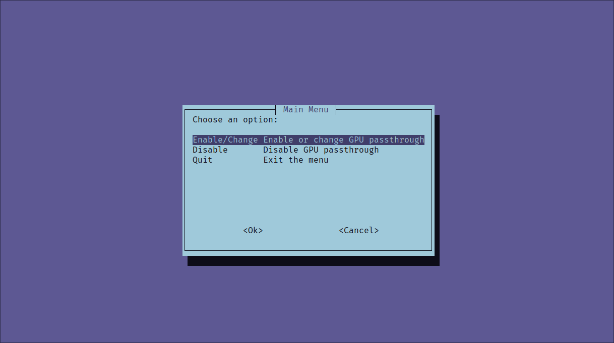
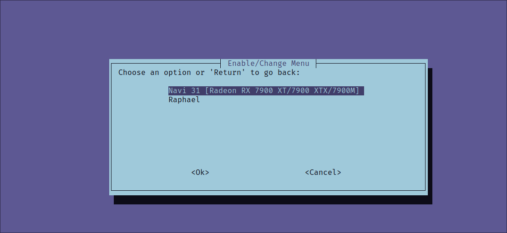

# ABOUT

This script is intended to automate process of configuring GPU passthrough on Arch-based distros with Dracut. There are plenty solutions that use mkinitcpio, but none for Arch+Dracut.

In general script is very simple - it detects your GPUs and gives you choice which one should be passed.

## PREREQUISITES

### Hardware

- **Two separate GPUs of different models**
- AMD CPU with AMD-Vi (Intel is not supported at this moment)
- Motherboard that supports IOMMU
- At least 1 modern AMD Radeon GPU (Nvidia is not supported at this moment)
- At least 16GB RAM

### Software

- Clean instance of Arch-based Linux distro. Preferably EndeavourOS
- Dracut installed and configured
- GRUB
- LSHW

## Getting Started

Clone or simply download this repo. Then copy gpu-passthrough.sh script to /usr/local/bin directory. 
If you would like to keep it up to date with git, you can create symlink instead.

## Enabling GPU Passthrough

**Always ensure that you make backup of your system. Any difference in setup can lead to non-bootable system.**

Run script **as root**.

You will see following menu:

Choose "Enable/Change". Script will search for GPUs. In my case it will be Radeon RX 7900 XTX as dGPU and Raphael as iGPU:

Choose whichever you prefer. And confirm.

Script will create all required files and update configs. It will automatically rebuild initramfs.

All you have to do is reboot.

**Note: GPU you select will not work in your OS. You have to connect your displays physically to second GPU!**

## Disabling GPU Passthrough

Run same script. This time choose "Disable" option. Script will remove all created files and remove changes from GRUB configuration. After reboot, you will be able to use your GPU again.
